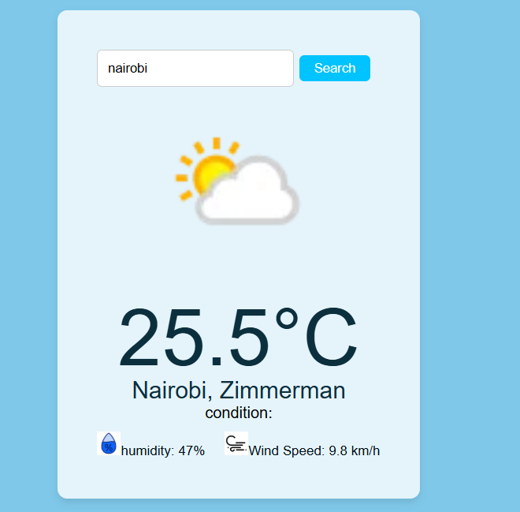

# Weather App

## Overview

A responsive weather application built with React and Vite that allows users to search for weather information by city. The application fetches real-time weather data and displays key weather metrics in a clean and user-friendly interface.

## Features

* Search weather by city name
* Display current temperature
* Display humidity levels
* Display wind speed
* Responsive design for desktop and mobile devices
* Error handling for invalid city names and API failures
* Loading state during data retrieval

## screenshots
## Screenshot




## Technologies Used

* React
* Vite
* JavaScript (ES6+)
* CSS3
* Weather API

## Installation

Clone the repository:

```bash
git clone <repository-url>
```

Navigate to the project folder:

```bash
cd weather-app
```

Install dependencies:

```bash
npm install
```

Create a `.env` file and add your API key:

```env
VITE_WEATHER_API_KEY=your_api_key_here
```

Start the development server:

```bash
npm run dev
```

## Deployment

The application is deployed on Render.

https://weather-app-bsh3.onrender.com/

## Author

Brenda Chebet
